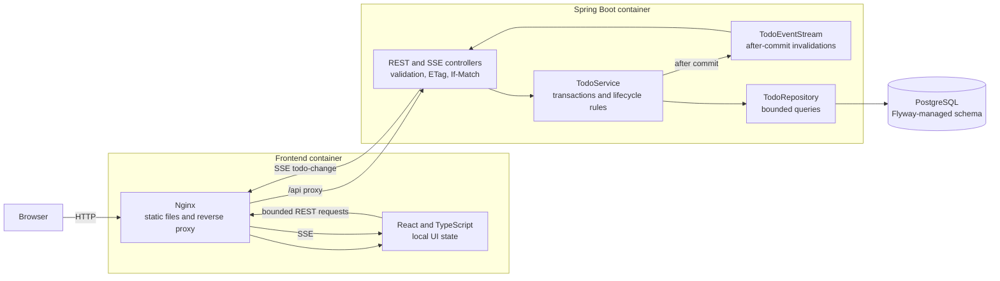

# Architecture

The application is a small modular monolith with a separate React client. REST remains the source of truth; Server-Sent Events only tell connected clients when to refetch their current bounded query.



## Important runtime contracts

- `GET`, `POST`, `PUT`, and `DELETE` use the REST API. The list endpoint performs filtering, domain sorting, and bounded pagination in PostgreSQL.
- Each TODO version is exposed as a strong `ETag`. Mutations require the matching value in `If-Match`; stale clients receive `412 TODO_VERSION_CONFLICT` and reload before retrying.
- Recurrence, dependency validation, and soft deletion run inside service transactions. The database adds optimistic-version and unique-successor safeguards.
- Change events are registered during the transaction but emitted only after commit. An event contains an ID, change type, TODO ID, and version, not a second copy of TODO state.
- The in-memory SSE broadcaster intentionally targets one application instance. A multi-instance deployment would require a transactional outbox and shared event transport.
- Docker Compose starts PostgreSQL, the backend, and the production Nginx frontend in health-check order. GitHub Actions runs backend integration tests, frontend tests and build, Playwright, and image builds.

## Code map

```text
frontend/src/                         React UI, API client, and component tests
frontend/e2e/                         Playwright browser workflows
src/main/java/.../todos/controller/   REST and SSE transport
src/main/java/.../todos/dto/          Request, response, error, and event contracts
src/main/java/.../todos/service/      Transactions and cross-TODO lifecycle rules
src/main/java/.../todos/model/        Persistent aggregate and domain enums
src/main/java/.../todos/repository/   PostgreSQL queries and persistence
src/main/resources/db/migration/      Versioned Flyway schema
```
